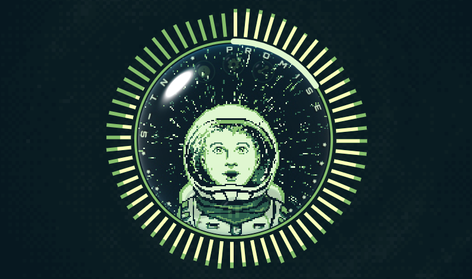

<div align="center">



<br/>


# MUP — S_TN Music Player

> Чиптюн-плеер для альбома **S_TN**, созданного на одном **Nintendo Game Boy Original** + [LittleSoundDJ](https://www.littlesounddj.com/)

[](https://s-tn.space/mup)
[](https://stanislavche.github.io/mup)
[](https://reactjs.org/)
[](LICENSE)

</div>

---

## 🌌 Демо

<div align="center">

</div>

---

## ✨ О проекте

**MUP** — браузерный плеер для альбома **S_TN**. Все 10 треков написаны исключительно на одном оригинальном Game Boy с картриджем LittleSoundDJ. Проект сочетает пиксельную эстетику, гиперпространственную анимацию звёзд и глубокий чиптюн-звук.

🎨 Обложки треков — художник **[@Katika_Taoka](https://www.instagram.com/katika_taoka_art/)**

---

## 🚀 Возможности

| Фича | Описание |
|---|---|
| 🎵 **10 треков × 2 версии** | Обработанная и raw с Game Boy |
| 🌌 **Hyperspace starfield** | GPU-ускоренная анимация звёзд на Canvas 2D (`alpha: false`) |
| 🎛️ **Эквалайзер** | Бас + высокие частоты в реальном времени через Web Audio API |
| 🔊 **Громкость** | Круговой слайдер |
| 📤 **Sharing** | VK, Telegram, Twitter, WhatsApp и другие |
| 📱 **Responsive** | iOS, Android, Desktop |

---

## 🎶 Треклист

| # | Название |
|---|----------|
| 1 | SERENITY |
| 2 | HOLY ROCKET |
| 3 | PROMISE |
| 4 | SPACE TIME |
| 5 | POPCORN |
| 6 | GOAL ACHIEVEMENT |
| 7 | CRYOGENIC DREAM |
| 8 | STARWAY |
| 9 | IMPETUS *(feat. BALLONBEAR)* |
| 10 | RAILROAD SWITCH |

📀 [Добавить в библиотеку (стриминг)](https://band.link/kR9Zc)

---

## ⚡ GPU-оптимизация анимации

Starfield написан на Canvas 2D с несколькими ключевыми оптимизациями:

- **`alpha: false`** при создании контекста — браузер не выполняет альфа-компостинг с DOM, что снимает значительную нагрузку с GPU
- **`desynchronized: true`** — canvas рендерится асинхронно с основным потоком DOM
- **`will-change: transform`** — CSS-подсказка браузеру для выделения отдельного GPU-слоя
- **Batch rendering** — 250 звёзд рисуются за 5 вызовов `ctx.fill()` (по бакетам яркости) вместо 250
- **Перспективная проекция** `sx = cx + x * (FOV / z)` — правильный вылет от центра к краям
- **Целые пиксели** (`| 0`) — никакого субпиксельного сглаживания
- **FPS cap 30** — равномерный темп анимации, экономия на мобильных
- **Равномерный z-спред при старте** — нет «пустого экрана» при загрузке

---

## 🛠️ Технологии

| Технология | Версия | Назначение |
|---|---|---|
| [React](https://reactjs.org/) | 17 | UI-фреймворк |
| [react-circular-input](https://github.com/peterpme/react-circular-input) | 0.2.x | Круговые слайдеры |
| [react-share](https://github.com/nygardk/react-share) | 4.x | Кнопки шаринга |
| [sass](https://sass-lang.com/) | 1.x | Стили SCSS |
| [material-icons](https://github.com/marella/material-icons) | 0.5.x | Иконки |
| [Web Audio API](https://developer.mozilla.org/en-US/docs/Web/API/Web_Audio_API) | native | Эквалайзер и визуализатор |
| [gh-pages](https://github.com/tschaub/gh-pages) | 3.x | Деплой |

---

## 💻 Запуск локально

### Требования

- Node.js ≥ 14
- Yarn

### Установка

```bash
# Клонировать репозиторий
git clone https://github.com/stanislavche/mup.git
cd mup

# Установить зависимости
yarn install

# Запустить в dev-режиме
yarn start
```

Приложение откроется на [http://localhost:3000](http://localhost:3000)

### Сборка и деплой

```bash
# Продакшн-сборка
yarn build

# Деплой на GitHub Pages
yarn deploy
```

---

## 👤 Авторы

- 🎵 **Музыка:** [S_TN](https://s-tn.space/mup)
- 🎨 **Арт:** [@Katika_Taoka](https://www.instagram.com/katika_taoka_art/)
- 💻 **Разработка:** [stanislavche](https://github.com/stanislavche)

---

<div align="center">

*Все треки записаны на одном Nintendo Game Boy Original*  
*с использованием картриджа LittleSoundDJ*

**🎮 One console. One cartridge. Ten tracks.**

</div>
